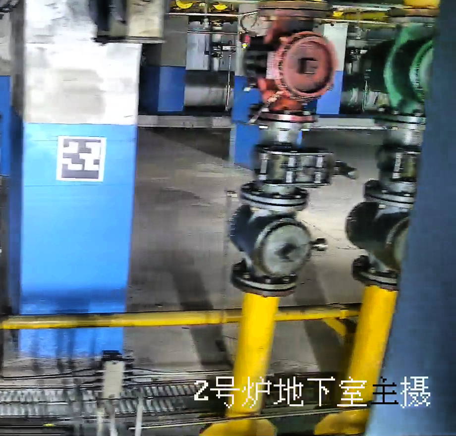
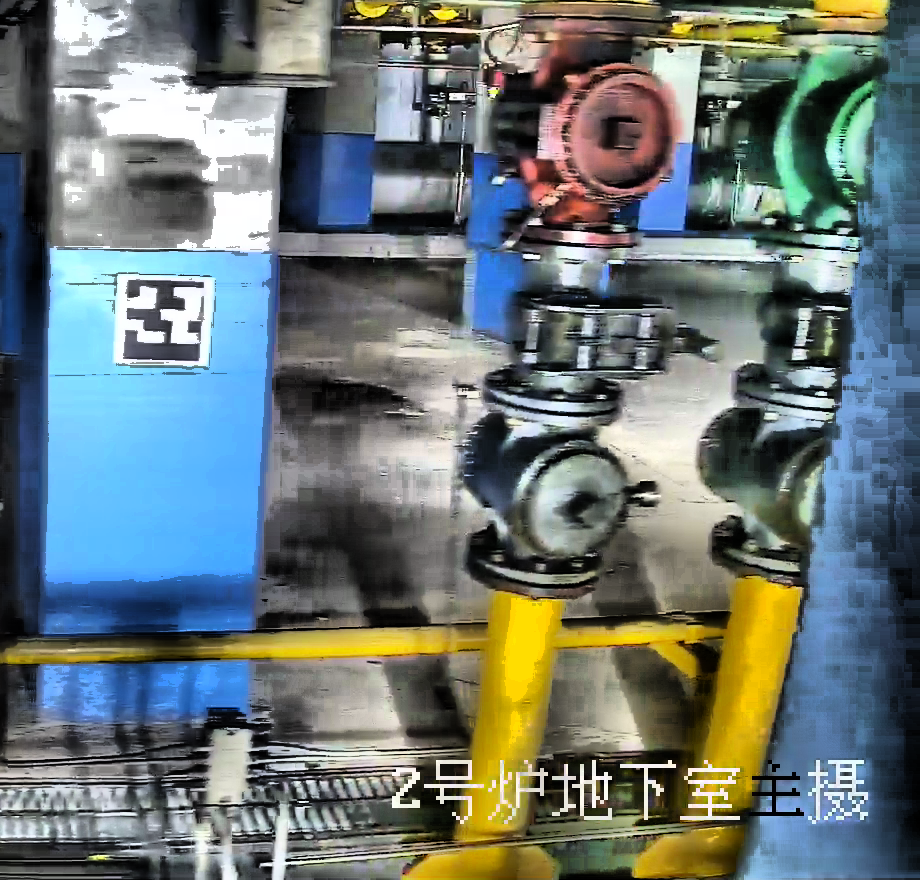

# Anti-reflective-algorithm
A method for increasing the recognition rate of aruco code or QR code by algorithm under reflective conditions （一种在反光条件下，通过算法增加aruco码或者QR码识别率的方法）



The process of reducing image reflection and enhancing edges using OpenCV can be divided into several steps. Here is a basic guide:

Read the image: Use the imread function from OpenCV to read the image.

Convert to HSV color space (optional): If color information is important for processing, consider converting the image from BGR to HSV color space. The HSV color space separates brightness and chrominance information more easily, which can help in dealing with reflections. Use the cvtColor function for conversion.

Reduce brightness or adjust the V channel: In the HSV color space, V represents brightness (Value). You can reduce reflections by decreasing the values in the V channel. If the image is in the BGR color space, you can consider reducing the values of all channels to decrease brightness, thus reducing reflections.

Apply Contrast Limited Adaptive Histogram Equalization (CLAHE): CLAHE is a method used to improve local contrast and enhance edges in an image. In OpenCV, you can use the createCLAHE function to create a CLAHE object and then apply it to the brightness or V channel of the image.

Save or display the image: Finally, use the imwrite function to save the processed image or the imshow function to display it in a window.

Here is a simple OpenCV Python code example that demonstrates how to reduce image reflections and enhance edges:


通过OpenCV减少图像反光并增强边缘的方法可以包括几个步骤。以下是一个基本的指南：

1. **读取图像**：
   使用OpenCV的`imread`函数读取图像。

2. **转换为HSV色彩空间**（可选）：
   如果图像的色彩信息对处理很重要，可以考虑将图像从BGR转换为HSV色彩空间。HSV色彩空间更容易分离亮度和色度信息，这有助于处理反光。使用`cvtColor`函数进行转换。

3. **降低亮度或调整V通道**：
   在HSV色彩空间中，V代表明度（Value）。可以通过降低V通道的值来减少反光。如果图像是在BGR色彩空间中，可以考虑降低所有通道的值来减少亮度，从而降低反光效果。

4. **应用对比度受限的自适应直方图均衡化（CLAHE）**：
   CLAHE是一种用于改进图像局部对比度和增强边缘的方法。在OpenCV中，可以使用`createCLAHE`函数来创建一个CLAHE对象，然后应用它于图像的亮度或V通道。

5. **保存或显示图像**：
   最后，使用`imwrite`函数保存处理后的图像，或使用`imshow`函数在窗口中显示图像。

以下是一个简单的OpenCV Python代码示例，演示了如何减少图像反光并增强边缘：

```python
import cv2
import numpy as np

# 读取图像
image = cv2.imread('aruco_marker.png')

# 转换为HSV色彩空间
hsv_image = cv2.cvtColor(image, cv2.COLOR_BGR2HSV)

# 分离HSV通道
h, s, v = cv2.split(hsv_image)

# 创建CLAHE对象并应用于V通道
clahe = cv2.createCLAHE(clipLimit=100.0, tileGridSize=(8,8))
v_clahe = clahe.apply(v)

# 合并处理后的HSV通道
hsv_image = cv2.merge([h, s, v_clahe])

# 转换回BGR色彩空间（如果之前转换过）
image_clahe = cv2.cvtColor(hsv_image, cv2.COLOR_HSV2BGR)


# 显示原始图像和处理后的图像
cv2.imshow('Original Image', image)
cv2.imshow('Processed Image', image_clahe)
cv2.waitKey(0)
cv2.destroyAllWindows()

# 保存处理后的图像（如果需要）
cv2.imwrite('reduced_glare_image.png', image_clahe)
```

请注意，以上代码只是一个基本示例，并且可能需要根据您的具体图像和需求进行调整。例如，CLAHE参数等都可能需要根据实际情况进行微调。



